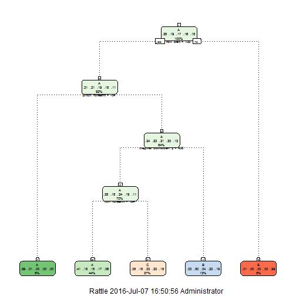

## Introduction

Using devices such as Jawbone Up, Nike FuelBand, and Fitbit it is now possible to collect a large amount of data about personal activity relatively inexpensively. These type of devices are part of the quantified self movement - a group of enthusiasts who take measurements about themselves regularly to improve their health, to find patterns in their behavior, or because they are tech geeks. One thing that people regularly do is quantify how much of a particular activity they do, but they rarely quantify how well they do it. In this project, your goal will be to use data  They were asked to perform barbell lifts correctly and incorrectly in 5 different ways. 

In the report, we make full use of the data from accelerometers on the belt, forearm, arm, and dumbell of 6 participants, and develop machine learning algorithms to identify the ways they perform lifts correctly and incorrectly in five differenct ways.

## Loading the Dataset

The required datasets are loaded from local working directories.


```r
setwd('D:/My Documents/data')
pml_training <- read.csv(file = 'pml-training.csv',sep=',',stringsAsFactors = FALSE)
pml_testing <- read.csv(file = 'pml-testing.csv',sep=',',stringsAsFactors = FALSE)
dim(pml_training)
```

```
## [1] 19622   160
```

```r
dim(pml_testing)
```

```
## [1]  20 160
```

We see that there are as many as 160 features, from which we would like to make selections to optimize classification performance, and minimize computation complexity in the meantime.

## Loading Packages

There are several packages that are necessary for model build-up, and visualization.


```r
library(ggplot2); library(caret); library(kernlab); library(randomForest); library(rattle); library(gridExtra)
```

```
## Loading required package: lattice
```

```
## 
## Attaching package: 'kernlab'
```

```
## The following object is masked from 'package:ggplot2':
## 
##     alpha
```

```
## Warning: package 'randomForest' was built under R version 3.3.1
```

```
## randomForest 4.6-12
```

```
## Type rfNews() to see new features/changes/bug fixes.
```

```
## 
## Attaching package: 'randomForest'
```

```
## The following object is masked from 'package:ggplot2':
## 
##     margin
```

```
## Warning: package 'rattle' was built under R version 3.3.1
```

```
## Rattle: A free graphical interface for data mining with R.
## XXXX 4.1.0 Copyright (c) 2006-2015 Togaware Pty Ltd.
## Type 'rattle()' to shake, rattle, and roll your data.
```

```
## 
## Attaching package: 'gridExtra'
```

```
## The following object is masked from 'package:randomForest':
## 
##     combine
```

## Data preprocessing and feature selection

In this section, we eliminate features with missing values or unique catatory, and from the rest select relevant features regarding part of bodies.


```r
isHomoFuc <- function (x) {
    if (length(unique(x)) == 1) {
        return(FALSE)
    }
    else {
        return(TRUE)
    }
}
```


```r
table(pml_training$classe)
```

```
## 
##    A    B    C    D    E 
## 5580 3797 3422 3216 3607
```

```r
isAnyMissing <- sapply(pml_testing, function (x) any(is.na(x) | x==""))
isHomo <- sapply(pml_testing, isHomoFuc)
toInclude <- !isAnyMissing & isHomo & grepl("belt|[^(fore)]arm|dumbbell|forearm", names(isAnyMissing))
featuresCandidate <- names(isAnyMissing)[toInclude]
pml_training <- pml_training[, c('classe',featuresCandidate)]
names(pml_training)
```

```
##  [1] "classe"               "roll_belt"            "pitch_belt"          
##  [4] "yaw_belt"             "total_accel_belt"     "gyros_belt_x"        
##  [7] "gyros_belt_y"         "gyros_belt_z"         "accel_belt_x"        
## [10] "accel_belt_y"         "accel_belt_z"         "magnet_belt_x"       
## [13] "magnet_belt_y"        "magnet_belt_z"        "roll_arm"            
## [16] "pitch_arm"            "yaw_arm"              "total_accel_arm"     
## [19] "gyros_arm_x"          "gyros_arm_y"          "gyros_arm_z"         
## [22] "accel_arm_x"          "accel_arm_y"          "accel_arm_z"         
## [25] "magnet_arm_x"         "magnet_arm_y"         "magnet_arm_z"        
## [28] "roll_dumbbell"        "pitch_dumbbell"       "yaw_dumbbell"        
## [31] "total_accel_dumbbell" "gyros_dumbbell_x"     "gyros_dumbbell_y"    
## [34] "gyros_dumbbell_z"     "accel_dumbbell_x"     "accel_dumbbell_y"    
## [37] "accel_dumbbell_z"     "magnet_dumbbell_x"    "magnet_dumbbell_y"   
## [40] "magnet_dumbbell_z"    "roll_forearm"         "pitch_forearm"       
## [43] "yaw_forearm"          "total_accel_forearm"  "gyros_forearm_x"     
## [46] "gyros_forearm_y"      "gyros_forearm_z"      "accel_forearm_x"     
## [49] "accel_forearm_y"      "accel_forearm_z"      "magnet_forearm_x"    
## [52] "magnet_forearm_y"     "magnet_forearm_z"
```

Next, we split the training data further into subclasses of training and validation data. The subclass of training dataset is used for building the model, and the validation set is used to evaluate out-of-sample errors.


```r
pml_training$classe <- as.factor(pml_training$classe)
inTrain <- createDataPartition(y=pml_training$classe,p=0.7,list=FALSE)
training <- pml_training[inTrain,]
validation <- pml_training[-inTrain,]
```

## Model Comparison

In the very beginning, we attempt the decision tree as our first trial.

### Decision Tree


```r
set.seed(233)
system.time(model_rpart <- train(classe ~ ., data = training, method = 'rpart'))
```

```
## Loading required package: rpart
```

```
##    user  system elapsed 
##   22.11    0.59   24.76
```

```r
model_rpart
```

```
## CART 
## 
## 13737 samples
##    52 predictor
##     5 classes: 'A', 'B', 'C', 'D', 'E' 
## 
## No pre-processing
## Resampling: Bootstrapped (25 reps) 
## Summary of sample sizes: 13737, 13737, 13737, 13737, 13737, 13737, ... 
## Resampling results across tuning parameters:
## 
##   cp          Accuracy   Kappa     
##   0.03580511  0.5150599  0.36989824
##   0.05991252  0.4030924  0.18562714
##   0.11575628  0.3242983  0.05978153
## 
## Accuracy was used to select the optimal model using  the largest value.
## The final value used for the model was cp = 0.03580511.
```

```r
fancyRpartPlot(model_rpart$finalModel,cex=.5,under.cex=1,shadow.offset=0)
```



From the model, only 4 out of 52 features are used, and therefore the resulting accuracy has not reached the required standard. As such, more advanced models are in need. We try Random Forest and Stochastic Gradient Boosting, and see their pros and cons. Due to computional complexity, a sample of training set is used for initial inspection and cross validation, which are presented as follows.

### Random Forest (Test)


```r
set.seed(233)
fitControl <- trainControl(method = 'repeatedcv', number = 5, repeats = 5, classProbs =
                               TRUE, savePredictions = TRUE,  allowParallel = TRUE)
system.time(model_rf <- train(classe ~ ., data = training[sample(1:dim(training)[1],1000),], method = 'rf', trControl= fitControl, verbose = FALSE))
```

```
##    user  system elapsed 
##  155.15    0.85  159.26
```

```r
model_rf
```

```
## Random Forest 
## 
## 1000 samples
##   52 predictor
##    5 classes: 'A', 'B', 'C', 'D', 'E' 
## 
## No pre-processing
## Resampling: Cross-Validated (5 fold, repeated 5 times) 
## Summary of sample sizes: 801, 801, 800, 798, 800, 801, ... 
## Resampling results across tuning parameters:
## 
##   mtry  Accuracy   Kappa    
##    2    0.8823943  0.8496214
##   27    0.8906014  0.8604608
##   52    0.8825992  0.8503001
## 
## Accuracy was used to select the optimal model using  the largest value.
## The final value used for the model was mtry = 27.
```

### Stochatic Gradient Boosting (Test)


```r
set.seed(233)
library(gbm)
```

```
## Warning: package 'gbm' was built under R version 3.3.1
```

```
## Loading required package: survival
```

```
## 
## Attaching package: 'survival'
```

```
## The following object is masked from 'package:caret':
## 
##     cluster
```

```
## Loading required package: splines
```

```
## Loading required package: parallel
```

```
## Loaded gbm 2.1.1
```

```r
system.time(model_gbm <- train(classe ~ ., method = 'gbm', data = training[sample(1:dim(training)[1],1000),], verbose = FALSE, trControl = fitControl))
```

```
## Loading required package: plyr
```

```
##    user  system elapsed 
##  131.39    0.39  138.47
```

```r
model_gbm
```

```
## Stochastic Gradient Boosting 
## 
## 1000 samples
##   52 predictor
##    5 classes: 'A', 'B', 'C', 'D', 'E' 
## 
## No pre-processing
## Resampling: Cross-Validated (5 fold, repeated 5 times) 
## Summary of sample sizes: 801, 801, 800, 798, 800, 801, ... 
## Resampling results across tuning parameters:
## 
##   interaction.depth  n.trees  Accuracy   Kappa    
##   1                   50      0.7300161  0.6547886
##   1                  100      0.7874072  0.7286606
##   1                  150      0.8124058  0.7606339
##   2                   50      0.8071926  0.7538589
##   2                  100      0.8449835  0.8022024
##   2                  150      0.8597838  0.8210177
##   3                   50      0.8366022  0.7914807
##   3                  100      0.8646149  0.8272399
##   3                  150      0.8768222  0.8428303
## 
## Tuning parameter 'shrinkage' was held constant at a value of 0.1
## 
## Tuning parameter 'n.minobsinnode' was held constant at a value of 10
## Accuracy was used to select the optimal model using  the largest value.
## The final values used for the model were n.trees = 150,
##  interaction.depth = 3, shrinkage = 0.1 and n.minobsinnode = 10.
```

Based on the above two test models, we see that their accuracy are close to each other. However, due to computational capacity, the cross validation is not included in the establishment of formal models. Next, we see the models.

### Random Forest


```r
set.seed(233)
system.time(model_rf1 <- train(classe ~ ., data = training, method = 'rf', verbose = FALSE,            preProcess=c('center','scale'), trControl=trainControl(classProbs = TRUE, savePredictions = TRUE,  allowParallel = TRUE)))
```

```
##    user  system elapsed 
## 6256.17   38.14 9229.05
```

```r
model_rf1
```

```
## Random Forest 
## 
## 13737 samples
##    52 predictor
##     5 classes: 'A', 'B', 'C', 'D', 'E' 
## 
## Pre-processing: centered (52), scaled (52) 
## Resampling: Bootstrapped (25 reps) 
## Summary of sample sizes: 13737, 13737, 13737, 13737, 13737, 13737, ... 
## Resampling results across tuning parameters:
## 
##   mtry  Accuracy   Kappa    
##    2    0.9885885  0.9855595
##   27    0.9888105  0.9858390
##   52    0.9805916  0.9754370
## 
## Accuracy was used to select the optimal model using  the largest value.
## The final value used for the model was mtry = 27.
```

```r
confusionMatrix(predict(model_rf1, newdata = validation), validation$classe)
```

```
## Confusion Matrix and Statistics
## 
##           Reference
## Prediction    A    B    C    D    E
##          A 1669    6    0    0    0
##          B    3 1130    1    0    0
##          C    1    3 1021   10    2
##          D    0    0    4  953    0
##          E    1    0    0    1 1080
## 
## Overall Statistics
##                                           
##                Accuracy : 0.9946          
##                  95% CI : (0.9923, 0.9963)
##     No Information Rate : 0.2845          
##     P-Value [Acc > NIR] : < 2.2e-16       
##                                           
##                   Kappa : 0.9931          
##  Mcnemar's Test P-Value : NA              
## 
## Statistics by Class:
## 
##                      Class: A Class: B Class: C Class: D Class: E
## Sensitivity            0.9970   0.9921   0.9951   0.9886   0.9982
## Specificity            0.9986   0.9992   0.9967   0.9992   0.9996
## Pos Pred Value         0.9964   0.9965   0.9846   0.9958   0.9982
## Neg Pred Value         0.9988   0.9981   0.9990   0.9978   0.9996
## Prevalence             0.2845   0.1935   0.1743   0.1638   0.1839
## Detection Rate         0.2836   0.1920   0.1735   0.1619   0.1835
## Detection Prevalence   0.2846   0.1927   0.1762   0.1626   0.1839
## Balanced Accuracy      0.9978   0.9956   0.9959   0.9939   0.9989
```

It has been seen that in-sample and out-of-sample errors are both over 99%, which is fairly good performance. We further investigate importance of features.

### Stochastic Gradient Boosting


```r
set.seed(233)
system.time(model_gbm1 <- train(classe ~ ., data = training, method = 'gbm', verbose =
    FALSE, preProcess=c('center','scale'), trControl=trainControl(classProbs = TRUE,
    savePredictions = TRUE,  allowParallel = TRUE)))
```

```
##    user  system elapsed 
## 2184.61    6.58 2429.82
```

```r
model_gbm1
```

```
## Stochastic Gradient Boosting 
## 
## 13737 samples
##    52 predictor
##     5 classes: 'A', 'B', 'C', 'D', 'E' 
## 
## Pre-processing: centered (52), scaled (52) 
## Resampling: Bootstrapped (25 reps) 
## Summary of sample sizes: 13737, 13737, 13737, 13737, 13737, 13737, ... 
## Resampling results across tuning parameters:
## 
##   interaction.depth  n.trees  Accuracy   Kappa    
##   1                   50      0.7526039  0.6862687
##   1                  100      0.8163856  0.7674555
##   1                  150      0.8491541  0.8089897
##   2                   50      0.8504141  0.8103401
##   2                  100      0.9031784  0.8774017
##   2                  150      0.9285882  0.9095961
##   3                   50      0.8930425  0.8645195
##   3                  100      0.9385243  0.9221805
##   3                  150      0.9577236  0.9464967
## 
## Tuning parameter 'shrinkage' was held constant at a value of 0.1
## 
## Tuning parameter 'n.minobsinnode' was held constant at a value of 10
## Accuracy was used to select the optimal model using  the largest value.
## The final values used for the model were n.trees = 150,
##  interaction.depth = 3, shrinkage = 0.1 and n.minobsinnode = 10.
```

```r
confusionMatrix(predict(model_gbm1, newdata = validation), validation$classe)
```

```
## Confusion Matrix and Statistics
## 
##           Reference
## Prediction    A    B    C    D    E
##          A 1650   31    0    1    3
##          B   15 1078   25    3   13
##          C    7   29  988   29    9
##          D    2    0   11  917   12
##          E    0    1    2   14 1045
## 
## Overall Statistics
##                                           
##                Accuracy : 0.9648          
##                  95% CI : (0.9598, 0.9694)
##     No Information Rate : 0.2845          
##     P-Value [Acc > NIR] : < 2.2e-16       
##                                           
##                   Kappa : 0.9555          
##  Mcnemar's Test P-Value : 6.94e-06        
## 
## Statistics by Class:
## 
##                      Class: A Class: B Class: C Class: D Class: E
## Sensitivity            0.9857   0.9464   0.9630   0.9512   0.9658
## Specificity            0.9917   0.9882   0.9848   0.9949   0.9965
## Pos Pred Value         0.9792   0.9506   0.9303   0.9735   0.9840
## Neg Pred Value         0.9943   0.9872   0.9921   0.9905   0.9923
## Prevalence             0.2845   0.1935   0.1743   0.1638   0.1839
## Detection Rate         0.2804   0.1832   0.1679   0.1558   0.1776
## Detection Prevalence   0.2863   0.1927   0.1805   0.1601   0.1805
## Balanced Accuracy      0.9887   0.9673   0.9739   0.9731   0.9811
```

Stochastic gradient boosting approaches around 95% precision for both in-sample and out-of-sample cases. Especially, it takes only one out of four time to train the model, which shows a better time-efficiency trade-off. As a result, this model is also retained for our final use.

In the end of this section, we take a look at how observations in the dataset are grouped based on extinguishing features identified by stochastic gradient boosting models.


```r
varImp(model_gbm1)
```

```
## gbm variable importance
## 
##   only 20 most important variables shown (out of 52)
## 
##                   Overall
## roll_belt         100.000
## pitch_forearm      46.723
## yaw_belt           36.607
## magnet_dumbbell_z  29.303
## magnet_dumbbell_y  24.036
## roll_forearm       22.830
## magnet_belt_z      17.957
## accel_forearm_x    14.931
## roll_dumbbell      13.967
## accel_dumbbell_y   13.188
## gyros_belt_z       13.010
## pitch_belt         10.746
## magnet_forearm_z    9.069
## gyros_dumbbell_y    8.575
## accel_forearm_z     7.627
## yaw_arm             6.882
## accel_dumbbell_x    6.375
## magnet_dumbbell_x   5.660
## magnet_arm_z        5.011
## magnet_arm_x        4.719
```


```r
q1 <- qplot(pitch_forearm, roll_belt, colour = classe, data = training)
q2 <- qplot(roll_belt, yaw_belt, colour = classe, data = training)
q3 <- qplot(yaw_belt, pitch_forearm, colour = classe, data = training)
q4 <- qplot(roll_belt, pitch_belt, colour = classe, data = training)
grid.arrange(q1, q2, q3, q4, nrow = 2, ncol = 2)
```


It is obvious that there are clear patterns of data clustering based on top 4 important features, which justifies our second models in an intuitive manner.

## Prediction for the testing set

Finally, we utilize the above two models to predict our test set.


```r
predict(model_rf1,newdata = pml_testing[,featuresCandidate], preProcess=c('center','scale'))
```

```
##  [1] B A B A A E D B A A B C B A E E A B B B
## Levels: A B C D E
```

```r
predict(model_gbm1,newdata = pml_testing[,featuresCandidate], preProcess=c('center','scale'))
```

```
##  [1] B A B A A E D B A A B C B A E E A B B B
## Levels: A B C D E
```

Surprizingly, the predictions with two models 100% agree with each other. This strengthen our belief of what the outcome should be.
